# Nite – Valorant Case Simulator

## Description

"**Nite – Valorant Case Simulator**" is an Android application where users can interact with weapon skins from VALORANT. The user can open cases, collect skins, raise the rank, customize the profile, view game statistics, make contracts and play other modes that will appear a little later.

**Nite has nothing to do with the real accounts of VALORANT players. The application is a simulator.**

Comparing with other apps of this type, **Nite** is probably the most beautiful, simple and fast-running application. It also does not contain any annoying ads while launching and using the app.

## How we use the API?

We do not use the Riot Games API at all. All necessary images (skins, agents, ranks, maps, etc.) are downloaded from *https://valorant.fandom.com*. We only need permission in the form of a written license agreement or a valid Riot API key to use that intellectual property.

## Future plans

As soon as (if) we get the permission, we will finish the existing prototype (see Prototype section), send it to you again for verification so that you make sure that everything is fine and the application does not violate any rights. Then we will publish it on the Google Play Store, where it will be completely free, without any in-app purchases.

## Ads

As mentioned in the description, the application does not (and will not) have any annoying ads while launching and using it. However, **at the request of the user**, it is possible to watch rewarded video ads, for example, to remake the contract in case of an unsuccessful choice.

**Ads will only be provided by Google Play Store.**

## Developers

**Nite** was developed (and will be) by two 20-year-old guys. We tried to read carefully and follow all the rules. However, **we ask you very much** ❤️, if we do something wrong, point it out to us so that we can fix the mistakes.

## Review

Set your name, team tag and choose your favourite agent

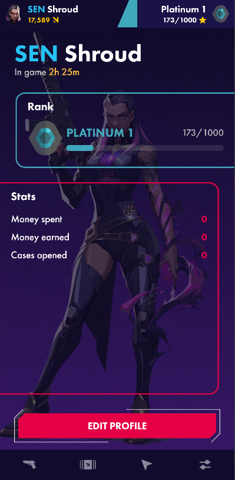 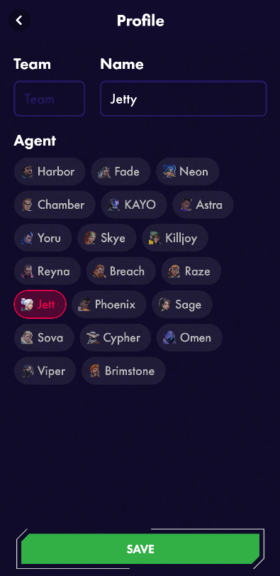 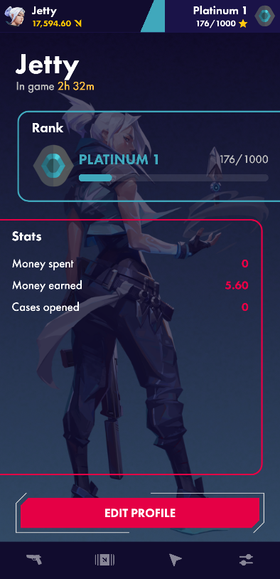

Collect your favorite skins, use the search to easier find the desired skins

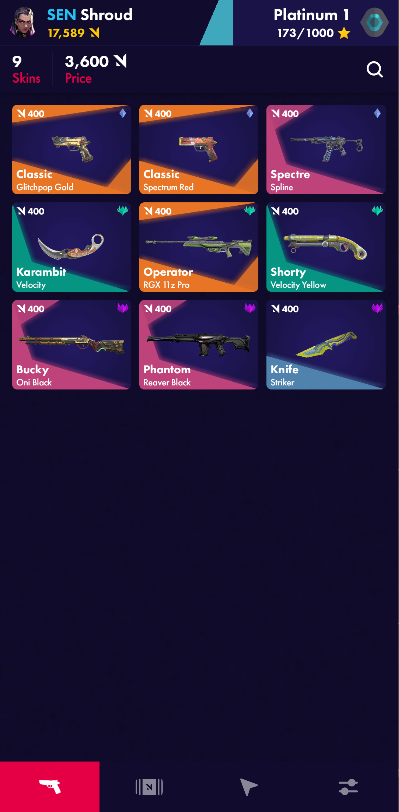 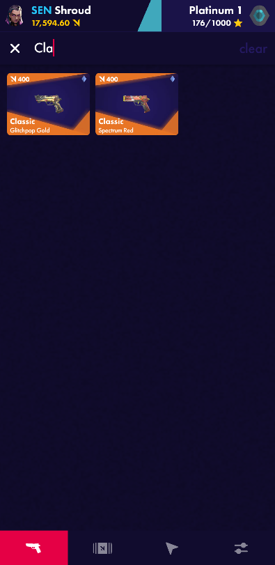 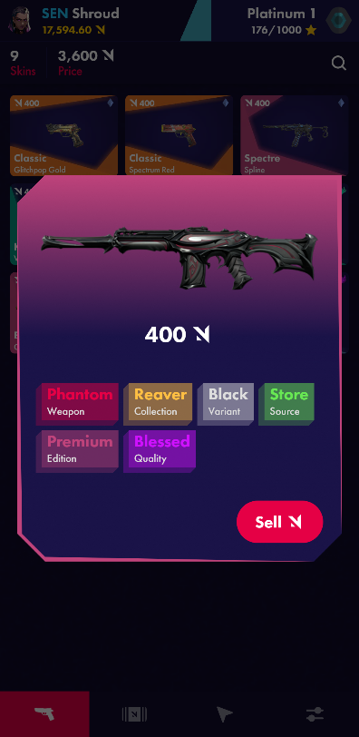

Open cases to get new skins

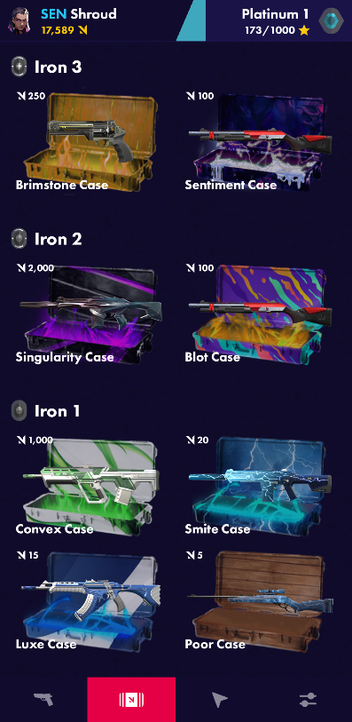 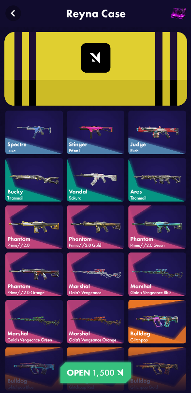 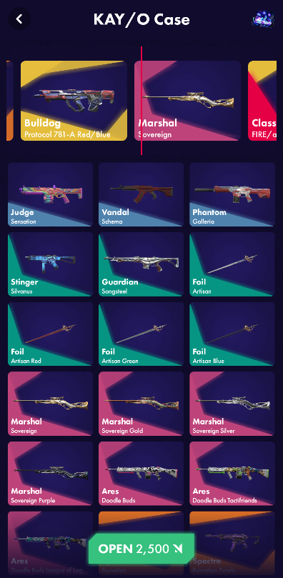

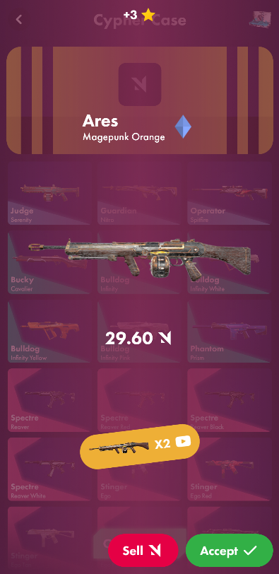

Use mode “clicker” to earn money

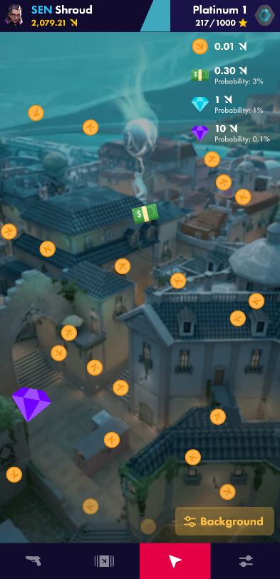 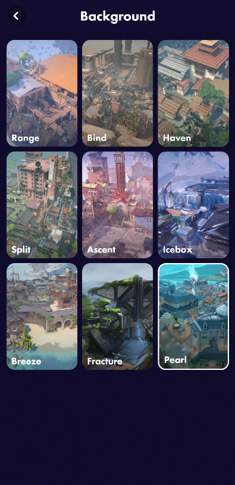 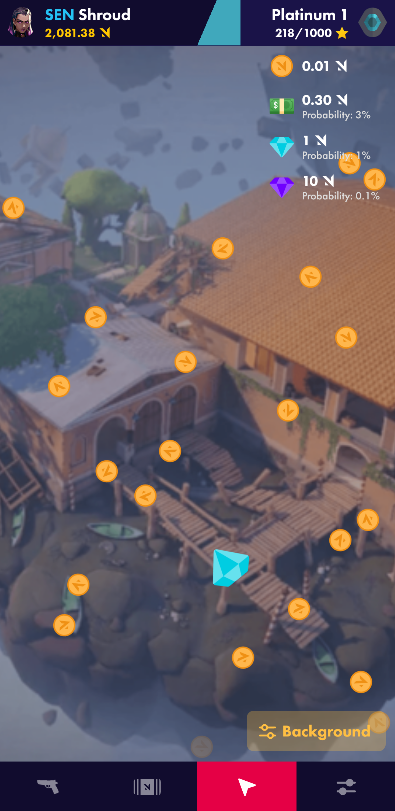

Make contracts to get new, more valuable skins

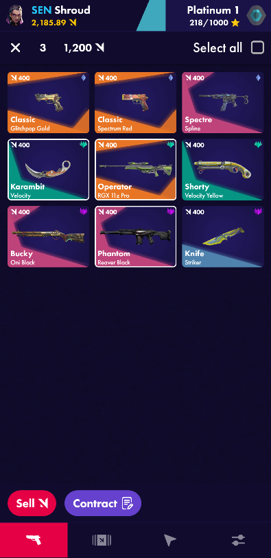 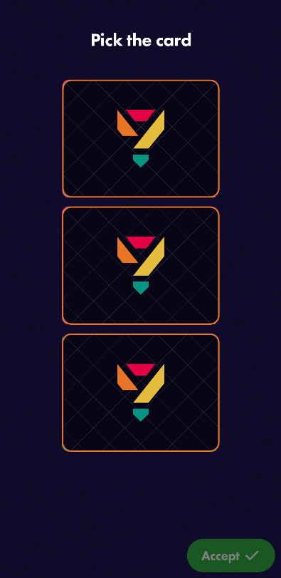 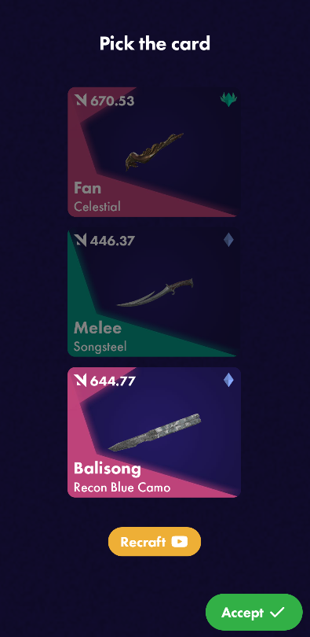

## Prototype

*https://drive.google.com/drive/folders/1-29qRB3JIXP9CXgejVGpRIEOin-OYQMZ?usp=sharing*
